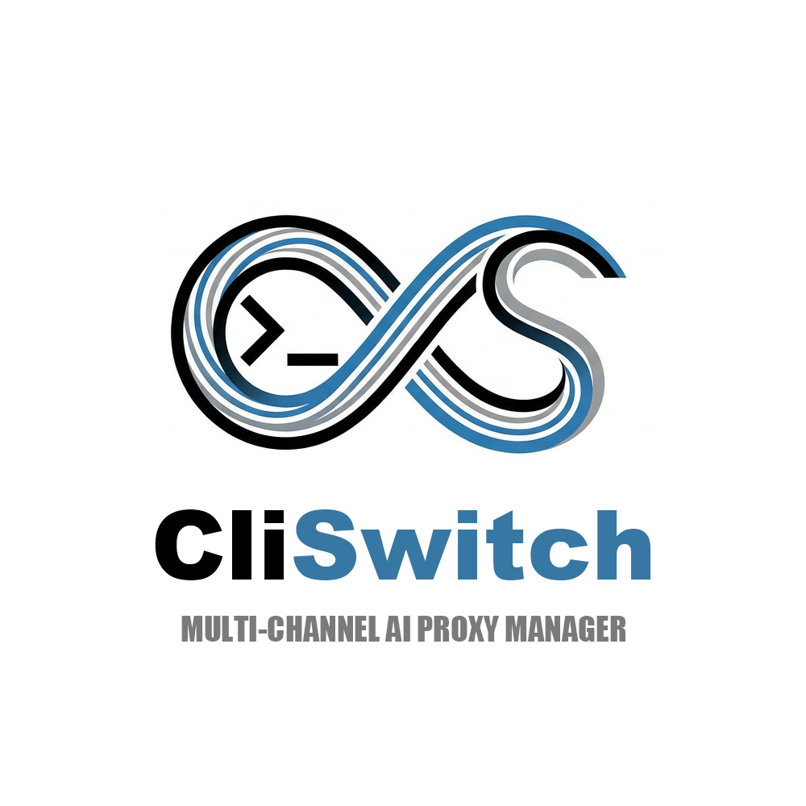
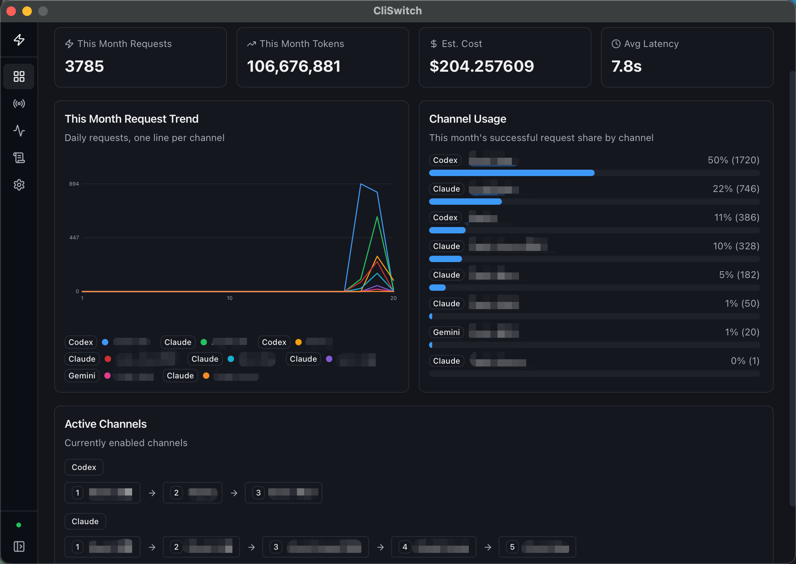
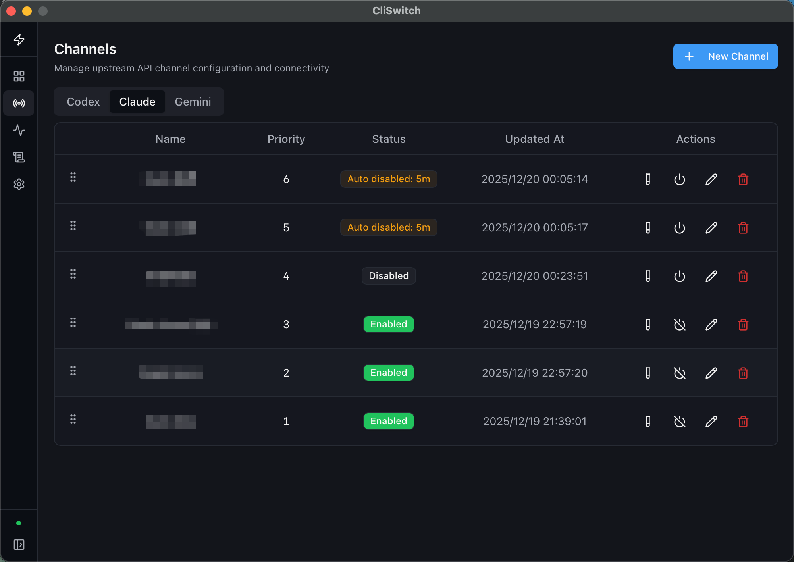
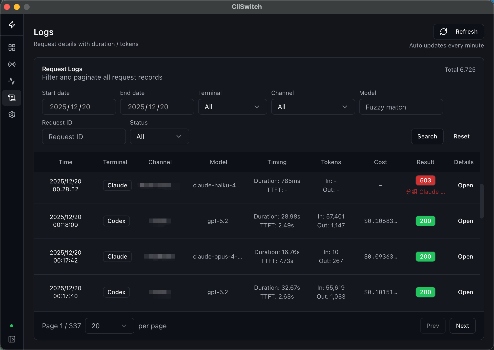
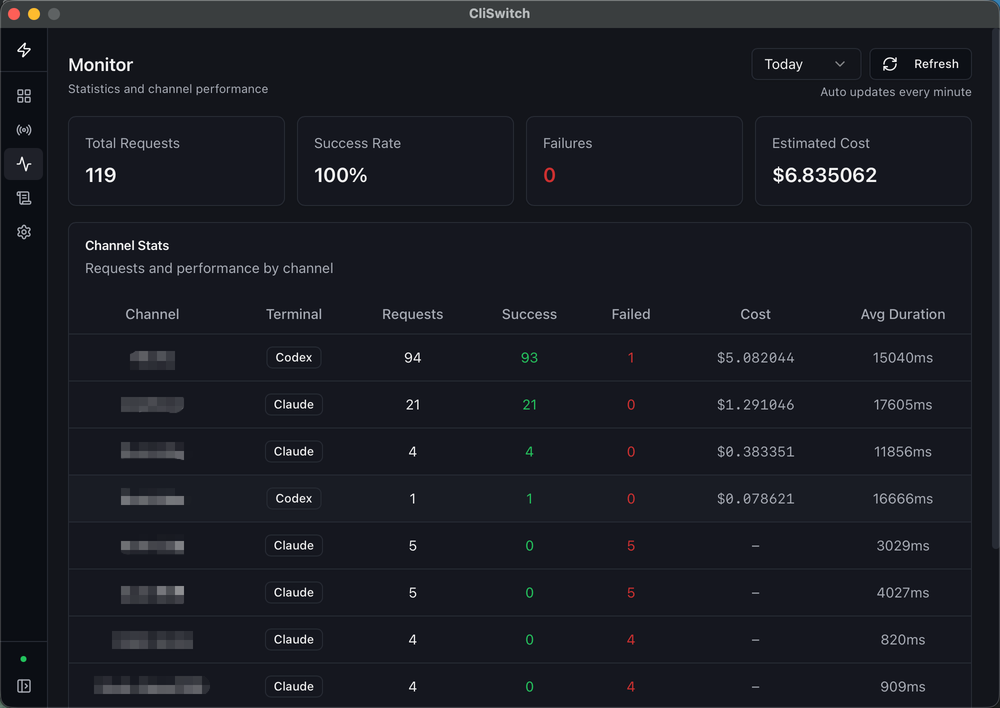
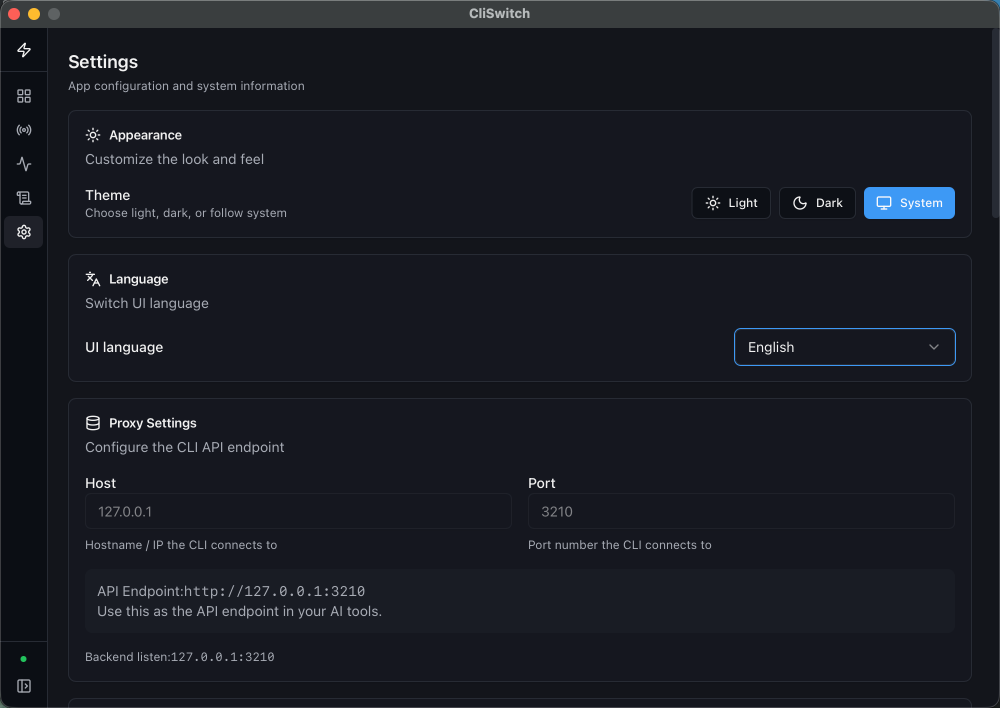

<div align="center">



# CliSwitch

**Local AI API Proxy & Management Center**

Unified Gateway · Multi-Channel Aggregation · Auto Failover

[](https://github.com/koumoe/cli-switch/releases/latest)
[](https://www.gnu.org/licenses/agpl-3.0)
[](https://github.com/koumoe/cli-switch/actions/workflows/ci.yml)
[](https://www.rust-lang.org/)
[](https://nodejs.org/)

[Download](#download) · [Features](#features) · [Contributing](#contributing)

English · [简体中文](docs/README_CN.md)

</div>

---

## Preview

### Dashboard

Real-time monitoring of request metrics and active channel retry chain at a glance.

<p align="center">
  
</p>

### Channels

Configure channel priority and auto-disable on failure — requests automatically route to healthy channels.

<p align="center">
  
</p>

### Logs

Track every request with latency, token usage, and estimated cost breakdown.

<p align="center">
  
</p>

<details>
<summary><strong>More Screenshots</strong></summary>

### Statistics

<p align="center">
  
</p>

### Settings

<p align="center">
  
</p>

</details>

---

## Why CliSwitch?

> Managing multiple AI API keys across different platforms? Want unified access, automatic failover, and transparent cost tracking?

**CliSwitch** is a native desktop app designed for AI developers and power users.

---

## Key Benefits

<table>
<tr>
<td width="50%">

### Simple & Easy

- **Zero Config** — Download and run, that's it
- **Unified Endpoint** — One address for all AI APIs
- **Visual Management** — Modern Web UI built-in

</td>
<td width="50%">

### Secure & Reliable

- **Local Only** — Listens on 127.0.0.1 only
- **Keys Stay Local** — Data stored in local SQLite
- **Auto Failover** — Switches to available channels

</td>
</tr>
<tr>
<td width="50%">

### Cost Transparency

- **Usage Tracking** — Real-time token consumption
- **Cost Estimation** — Auto-sync model pricing
- **Trend Analysis** — Visual spending reports

</td>
<td width="50%">

### Data Compliance

- **Local First** — Keys and logs stored locally only
- **No Telemetry** — No analytics or tracking
- **Open Source** — AGPL-3.0 licensed

</td>
</tr>
</table>

---

## Features

- **Multi-Channel Management** — Configure multiple keys across OpenAI / Anthropic / Gemini
- **Priority-Based Routing** — Requests routed by channel priority
- **Automatic Failover** — Seamlessly switch on upstream errors
- **Auto Disable** — Temporarily disable failing channels (configurable)
- **Usage Statistics** — Track latency, TTFT, tokens, and estimated costs
- **Price Sync** — Automatic model pricing updates
- **Single Binary** — Native desktop app with embedded frontend

---

## Proxy Endpoints

| Protocol | Proxy Endpoint |
|:---:|:---|
| **OpenAI** | `http://127.0.0.1:3210/v1` |
| **Anthropic** | `http://127.0.0.1:3210/v1/messages` |
| **Gemini** | `http://127.0.0.1:3210/v1beta` |

> Compatible with any client/SDK that supports custom Base URL

---

## Download

Go to [Releases](https://github.com/koumoe/cli-switch/releases/latest) to download:

| Platform | Download |
|:---:|:---|
| macOS (Apple Silicon) | `CliSwitch-x.x.x-macos-arm64.zip` |
| macOS (Intel) | `CliSwitch-x.x.x-macos-x64.zip` |
| Windows (x64) | `CliSwitch-x.x.x-windows-x64.zip` |
| Windows (ARM64) | `CliSwitch-x.x.x-windows-arm64.zip` |
| Linux (x64) | `cliswitch-x.x.x-linux-x64.tar.gz` |
| Linux (ARM64) | `cliswitch-x.x.x-linux-arm64.tar.gz` |

### Quick Start

1. Download the archive for your platform
2. Unpack and launch the app (macOS: `CliSwitch.app`, Windows: `CliSwitch.exe`, Linux: `./cliswitch`)
3. Add your API channels
4. Point your client to `http://127.0.0.1:3210`

Done!

<!-- Screenshot: Quick Start GIF -->
<!-- <p align="center">
  
</p> -->

---

## Build from Source

<details>
<summary>Click to expand</summary>

**Requirements:** Rust 1.92.0 / Node.js 25.2.1

```bash
# Clone
git clone https://github.com/koumoe/cli-switch.git
cd cli-switch

# Build frontend
cd ui && npm ci && npm run build && cd ..

# Build desktop app
cargo build --release
```

</details>

---

## Contributing

We welcome contributions! Here's how you can help:

- **Bug Reports** — [Open an issue](https://github.com/koumoe/cli-switch/issues)
- **Feature Requests** — Share your ideas via issues
- **Pull Requests** — Fork, code, and submit a PR
- **Documentation** — Help improve docs and translations

---

## License

This project is licensed under [AGPL-3.0](https://www.gnu.org/licenses/agpl-3.0).

---

<div align="center">

**CliSwitch** — Simplify Your AI API Management

[GitHub](https://github.com/koumoe/cli-switch) · [Issues](https://github.com/koumoe/cli-switch/issues) · [Releases](https://github.com/koumoe/cli-switch/releases)

</div>
