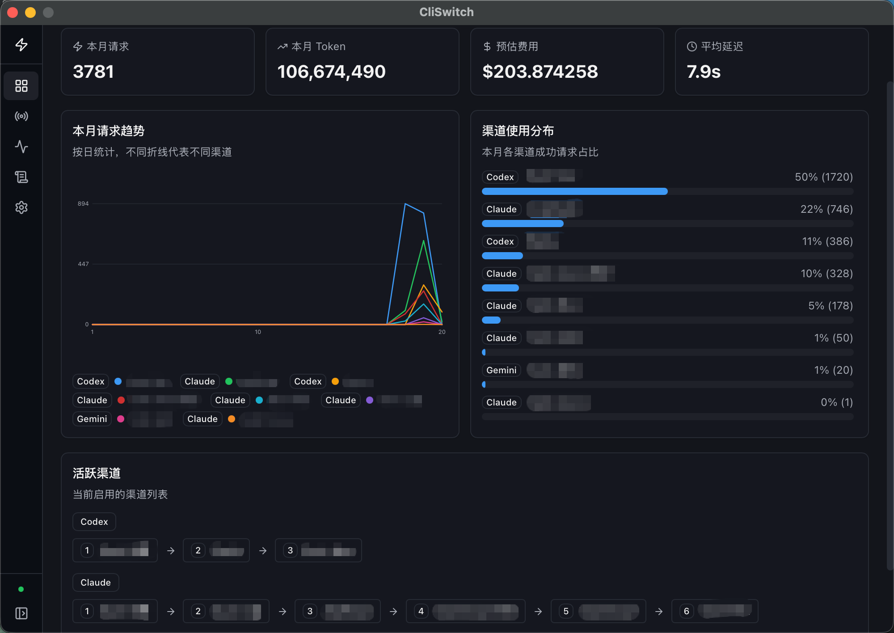
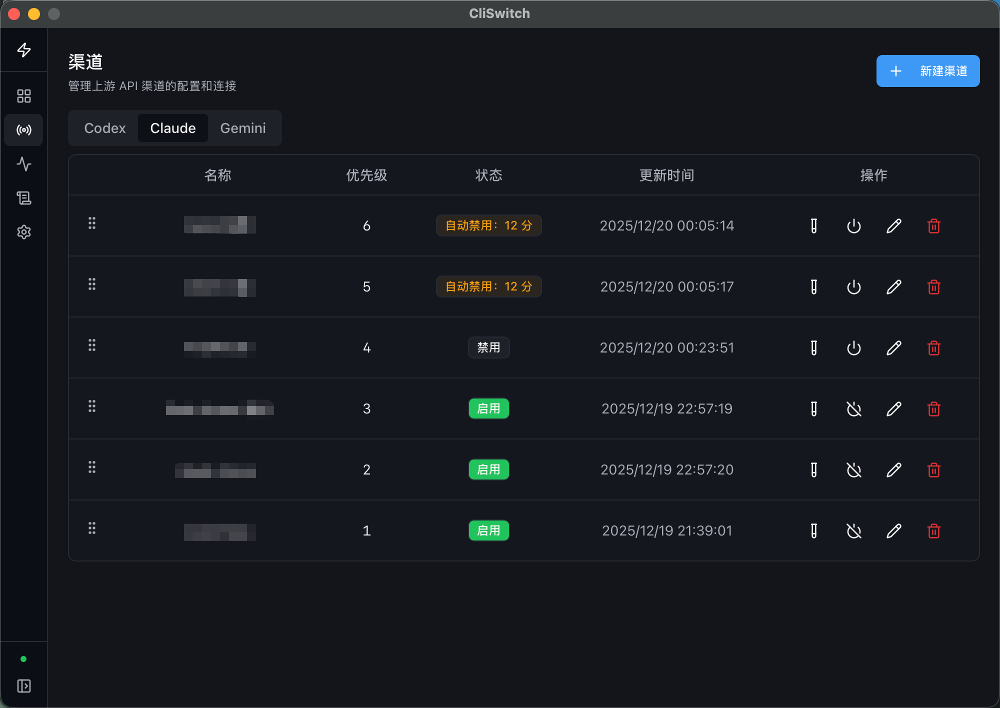
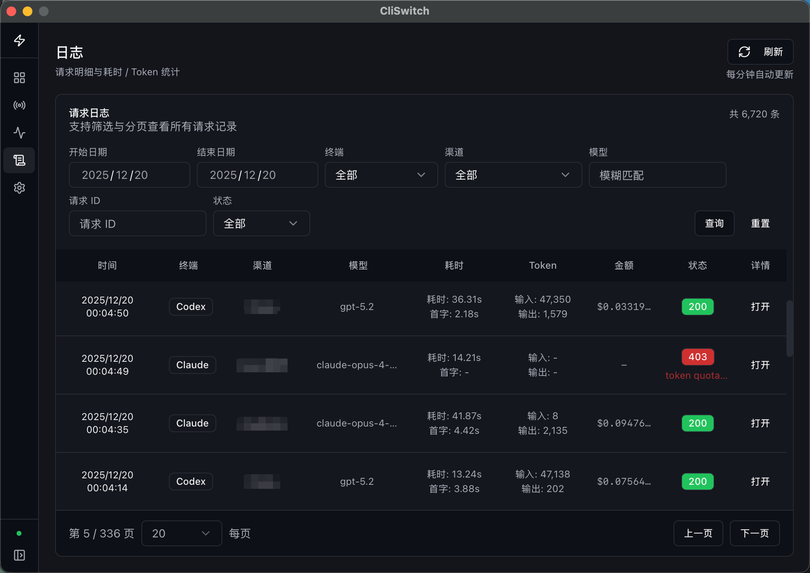
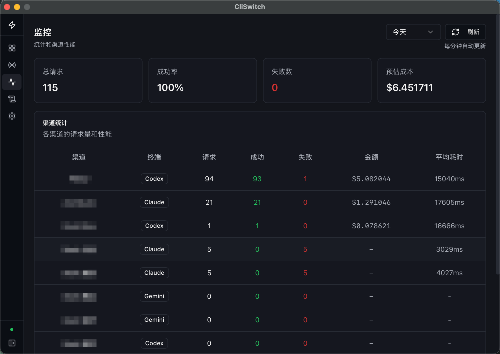
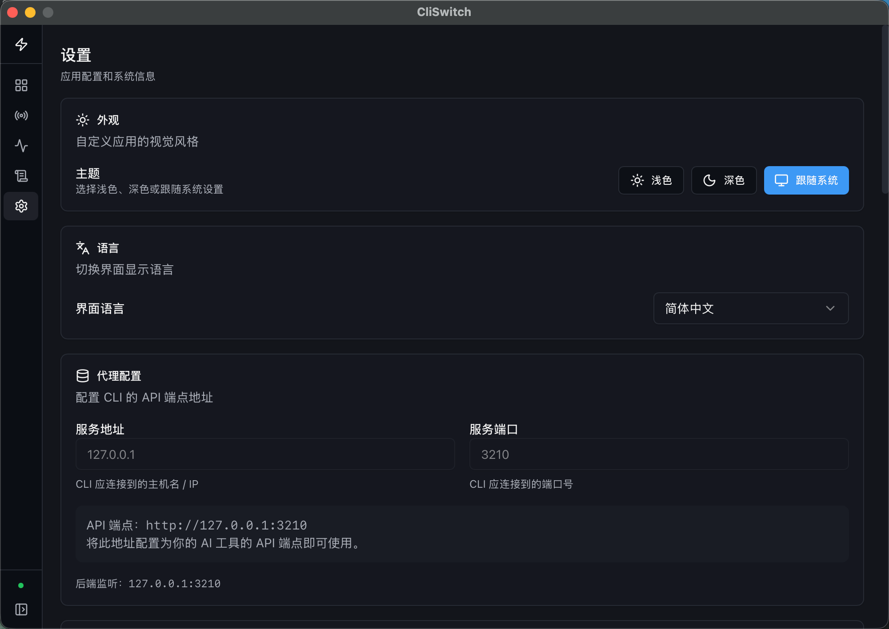

<div align="center">


# CliSwitch

**本地 AI API 代理管理中心**

统一入口 · 多渠道聚合 · 故障自动转移

[](https://github.com/koumoe/cli-switch/releases/latest)
[](https://www.gnu.org/licenses/agpl-3.0)
[](https://github.com/koumoe/cli-switch/actions/workflows/ci.yml)
[](https://www.rust-lang.org/)
[](https://nodejs.org/)

[下载安装](#下载安装) · [功能特性](#功能特性) · [参与贡献](#参与贡献)

[English](../README.md) · 简体中文

</div>

---

## 界面预览

### 仪表台

实时监控请求数据，一眼掌握活跃渠道与重试链路状态。

<p align="center">
  
</p>

### 渠道管理

配置渠道优先级，失败自动禁用 — 请求自动路由到健康渠道。

<p align="center">
  
</p>

### 请求日志

追踪每一次请求：耗时、Token 用量、费用估算一目了然。

<p align="center">
  
</p>

<details>
<summary><strong>查看更多截图</strong></summary>

### 用量统计

<p align="center">
  
</p>

### 设置

<p align="center">
  
</p>

</details>

---

## 为什么选择 CliSwitch？

> 你有多个 AI API Key？分散在不同平台？想要统一管理、自动切换、费用透明？

**CliSwitch** 是一款本地运行的桌面应用，专为 AI 开发者和重度用户打造。

---

## 核心优势

<table>
<tr>
<td width="50%">

### 简洁易用

- **开箱即用** — 下载即运行，无需配置
- **统一入口** — 一个地址代理所有 AI API
- **可视化管理** — 现代化 Web UI，告别命令行

</td>
<td width="50%">

### 安全可靠

- **本地运行** — 仅监听 127.0.0.1
- **Key 不出本机** — 数据存储在本地 SQLite
- **故障转移** — 自动切换可用渠道

</td>
</tr>
<tr>
<td width="50%">

### 费用透明

- **用量统计** — Token 使用量实时追踪
- **费用估算** — 自动同步模型价格
- **趋势分析** — 可视化消费报表

</td>
<td width="50%">

### 数据合规

- **本地优先** — Key 与日志仅存本机
- **无遥测** — 不收集任何分析数据
- **开源透明** — AGPL-3.0 许可证

</td>
</tr>
</table>

---

## 功能特性

- **多渠道管理** — 同平台多 Key / 多平台混合配置（OpenAI / Anthropic / Gemini）
- **优先级路由** — 按渠道优先级智能分发请求
- **故障转移** — 上游出错时自动切换下一个渠道
- **自动禁用** — 短时间内失败过多自动进入冷却期（可配置）
- **用量统计** — 记录请求耗时、TTFT、Token 使用量与估算费用
- **价格同步** — 自动同步最新模型价格
- **单文件分发** — 原生桌面应用，内嵌前端资源

---

## 支持协议

| 协议 | 代理入口 |
|:---:|:---|
| **OpenAI** | `http://127.0.0.1:3210/v1` |
| **Anthropic** | `http://127.0.0.1:3210/v1/messages` |
| **Gemini** | `http://127.0.0.1:3210/v1beta` |

> 兼容所有支持自定义 Base URL 的客户端/SDK

---

## 下载安装

前往 [Releases](https://github.com/koumoe/cli-switch/releases/latest) 下载对应平台安装包：

| 平台 | 下载 |
|:---:|:---|
| macOS (Apple Silicon) | `CliSwitch-x.x.x-macos-arm64.zip` |
| macOS (Intel) | `CliSwitch-x.x.x-macos-x64.zip` |
| Windows (x64) | `CliSwitch-x.x.x-windows-x64.zip` |
| Windows (ARM64) | `CliSwitch-x.x.x-windows-arm64.zip` |
| Linux (x64) | `cliswitch-x.x.x-linux-x64.tar.gz` |
| Linux (ARM64) | `cliswitch-x.x.x-linux-arm64.tar.gz` |

### 快速开始

1. 下载并安装
2. 启动应用
3. 添加你的 API 渠道
4. 将客户端指向 `http://127.0.0.1:3210`

完成！

<!-- 截图：快速配置流程 GIF -->
<!-- <p align="center">
  
</p> -->

---

## 从源码构建

<details>
<summary>点击展开</summary>

**环境要求：** Rust 1.92.0 / Node.js 25.2.1

```bash
# 克隆仓库
git clone https://github.com/koumoe/cli-switch.git
cd cli-switch

# 构建前端
cd ui && npm ci && npm run build && cd ..

# 构建桌面端
cargo build --release
```

</details>

---

## 参与贡献

欢迎参与贡献！你可以通过以下方式参与：

- **Bug 反馈** — [提交 Issue](https://github.com/koumoe/cli-switch/issues)
- **功能建议** — 通过 Issue 分享你的想法
- **代码贡献** — Fork 项目，提交 PR
- **文档改进** — 帮助完善文档和翻译

---

## 许可证

本项目采用 [AGPL-3.0](https://www.gnu.org/licenses/agpl-3.0) 许可证。

---

<div align="center">

**CliSwitch** — 让 AI API 管理更简单

[GitHub](https://github.com/koumoe/cli-switch) · [问题反馈](https://github.com/koumoe/cli-switch/issues) · [下载](https://github.com/koumoe/cli-switch/releases)

</div>
